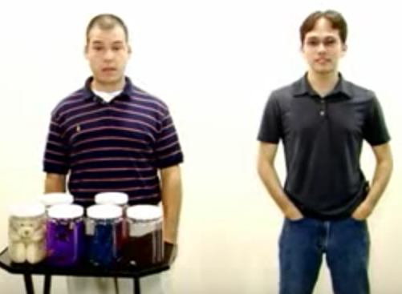
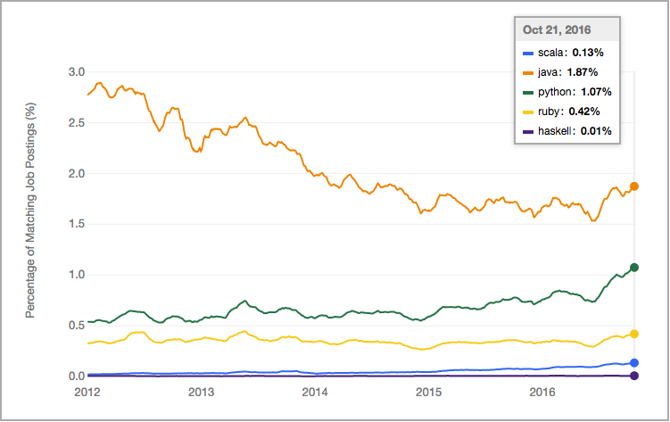
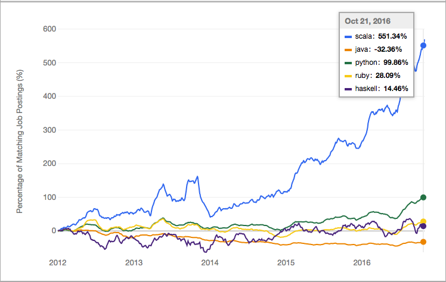

class: center, middle, inverse
# [@Scala](https://twitter.com/scala_lang) for Ruby Developers

### 2016-12-19


## [@halyph](http://twitter.com/halyph)

## I ❤️ Scala

---

# Disclaimer

- I'm seasonal Ruby developer (I.e. use it occasionally)

- This talks is not about Ruby vs Scala

- **Aim of this talk is to motivate You to move outside**

---

class: center, middle, inverse

# Why Should we Look  Around?

## Ruby is so awesome, isn't it? 

---

# [Who left Ruby Community?](http://halyph.com/blog/2016/11/27/who-left-ruby-community.html)

| Name            | Info                                                                            | Ruby Community                      | Alt/New Community                                         |
|-----------------|---------------------------------------------------------------------------------|-------------------------------------|-------------------------------------------------------|
| Yehuda Katz     | [github](https://github.com/wycats), [site](http://yehudakatz.com/)             | Merb, Ruby on Rails, Bundler, Thor        | Rust                                            |
| Steve Klabnik   | [github](https://github.com/steveklabnik), [site](http://www.steveklabnik.com/) | Ruby on Rails                       | Rust                                                  |
| José Valim      | [github](https://github.com/josevalim)                                          | Ruby on Rails                       | Elixir                                                |
| Dave Thomas     | [github](https://github.com/pragdave), [blog](https://pragdave.me/)             | wrote the 1st English Ruby Book in 2000 | Elixir                                            |
| Matt Aimonetti  | [github](https://github.com/mattetti), [site](https://matt.aimonetti.net/)      | Merb, MacRuby                       | Golang                                                |
| Mark Bates      | [github](https://github.com/markbates), [site](http://www.metabates.com/)       | Ruby Conf Speacker, Screencast      | Golang                                                |
| Blake Mizerany  | [github](https://github.com/bmizerany)                                          | Sinatra                             | Golang                                                |
| Katrina Owen    | [github](https://github.com/kytrinyx), [site](http://www.kytrinyx.com/)         | Ruby Conf Speacker                  | Golang, Ruby                                          |
| Bryan Liles     | [github](https://github.com/bryanl)                                             | Ruby Conf Speacker                  | Golang                                                |
| Chad Fowler     | [github](https://github.com/chad), [site](http://chadfowler.com/)               | Ruby Conf orginizer, Ruby Books writer    | Ruby, Scala, Clojure                            |
| David Chelimsky | [github](https://github.com/dchelimsky)                                         | RSpec                               | Ruby, Clojure                                         |
| Chris McCord    | [github](https://github.com/chrismccord)                                        | Ruby on Rails                       |  Elixir |


---

# People are Moving to 

- [Elixir](http://elixir-lang.org/) and [Phoenix Framework](http://www.phoenixframework.org/)

- [Golang](https://golang.org/)

- [Rust](https://www.rust-lang.org)

## Or trying to create _Ruby_-like **statically** type-checked language

- [Crystal](https://crystal-lang.org/)

---

# Ruby Community

- if you say **Ruby** you mean **Ruby on Rails** (90%)

- DevOps tools: [Chef](https://www.chef.io/) or [Puppet](https://puppet.com/)

- Penetration testing: [Metasploit](https://www.metasploit.com/)


## .right[ _There is no diversity_]

.right[]

---

# [Java vs Ruby on Rails (by Rails Envy), 2007](https://www.youtube.com/watch?v=SsYKd37r26s)

.center[]

.center[Today **Ruby on Rails** looks the same as _Java_ from this video]

---

class: center, middle, inverse

# Ruby Bad Smells

---

# Runtime

- MRI domination :-(
  - it is slow
  - MRI on Windows suck
  - No JIT compilation
  - Ruby core library :-(
  
# Documentation

- Ruby Documentaion just suck: http://ruby-doc.org/

## Compare with

- [Python](https://python.org): https://docs.python.org

- [Scala](http://www.scala-lang.org/): http://www.scala-lang.org/documentation/
  - Library API: http://www.scala-lang.org/api/2.12.1/

---

# Ruby Language - Bad Parts

 - [Ruby: The Bad Parts by _Bozhidar Batsov_](the-bad-parts-by-bozhidar_batsov/README.md)
 - [Ruby and Rails: The Bad Parts by _Volodymyr Melnyk_](ruby-and-rails-the-bad-parts-by-volodymyr-melnyk/README.md)
 
 
---

## My Favorites

- `load` vs `require` vs `include` vs `extend` vs `prepend`
- Ruby Nested Modules (_see_ [Creating Namespaces In Ruby For Fun And Practice](http://justinherrick.com/blog/creating-namespaces-in-ruby-for-fun-and-practice/))

.left-column[
```ruby
module Github
  module Users
    module Repositories
      module Utilities
        module Greeter
          def self.greet
            'hello'
          end
        end
      end
    end
  end
end
```

]

.right-column[
```ruby
module Github::Users::Repositories::Utilities::Greeter
  def self.greet
    'hello'
  end
end
```
]

---

## My Favorites (cont.)

- Ruby Constants are *fake*
- `unless` - WTF?
- `%-` something literals (`%s, %x, %w, %W, %r, %q, %Q, %, %i`)
- Overuse of [Monkey patching](https://en.wikipedia.org/wiki/Monkey_patch)
- [Proc vs Lambda](http://awaxman11.github.io/blog/2013/08/05/what-is-the-difference-between-a-block/)

```ruby
lam = lambda { |x| puts x }    # creates a lambda that takes 1 argument
lam.call(2)                    # prints out 2
lam.call                       # ArgumentError: wrong number of arguments (0 for 1)
lam.call(1,2,3)                # ArgumentError: wrong number of arguments (3 for 1)

proc = Proc.new { |x| puts x } # creates a proc that takes 1 argument
proc.call(2)                   # prints out 2
proc.call                      # returns nil
proc.call(1,2,3)               # prints out 1 and forgets about the extra arguments

```


---


---

class: center, middle, inverse


# Scala

---

# Indeed  Job Trends - [Absolute](https://www.indeed.com/jobtrends/q-scala-q-java-q-python-q-ruby-q-haskell.html)

.center[]

---

# Indeed  Job Trends - [Relative](https://www.indeed.com/jobtrends/q-scala-q-java-q-python-q-ruby-q-haskell.html?relative=1)

.center[]

---

# [Who's using Scala?](http://bit.ly/2gZL328)
- Twitter
- Gilt
- Foursquare
- SpinGo
- Coursera
- Apple Inc.
- The Guardian newspaper
- The New York Times
- The Huffington Post newspaper
- Swiss bank UBS
- LinkedIn
- Meetup
- Remember the Milk
- Verizon
- Airbnb
- Zalando
- SoundCloud 
- Databricks
- Morgan Stanley
- Walmart Canada

---

# Scala Language

--

- Targeted for: JVM, JS and Native

--

- Object-Oriented and Functional Language

--

- Strong static type system

--

- Immutability

--

- Type inference

--

- Everething is an expression

---

class: center, middle, inverse


# DSLs in Scala

---

## [BASIC-like DSL](http://blog.fogus.me/2009/03/26/baysick-a-scala-dsl-implementing-basic/)
```
object Lunar extends Baysick {
  def main(args:Array[String]) = {
    10 PRINT "Welcome to Baysick Lunar Lander v0.9"
    20 LET ('dist := 100)
    30 LET ('v := 1)
    40 LET ('fuel := 1000)
    50 LET ('mass := 1000)
    60 PRINT "You are drifting towards the moon."
    70 PRINT "You must decide how much fuel to burn."
    80 PRINT "To accelerate enter a positive number"
    90 PRINT "To decelerate a negative"
    100 PRINT "Distance " % 'dist % "km, " % "Velocity " % 'v % "km/s, " % "Fuel " % 'fuel
    110 INPUT 'burn
    120 IF ABS('burn) <= 'fuel THEN 150
    130 PRINT "You don't have that much fuel"
    140 GOTO 100
    150 LET ('v := 'v + 'burn * 10 / ('fuel + 'mass))
    160 LET ('fuel := 'fuel - ABS('burn))
    170 LET ('dist := 'dist - 'v)
    180 IF 'dist > 0 THEN 100
    190 PRINT "You have hit the surface"
    200 IF 'v < 3 THEN 240
    210 PRINT "Hit surface too fast (" % 'v % ")km/s"
    220 PRINT "You Crashed!"
    230 GOTO 250
    240 PRINT "Well done"
    250 END
    RUN
  }
}
```

---

## [ScalaTest](http://www.scalatest.org/user_guide/selecting_a_style) 

```
import org.scalatest.FunSpec

class SetSpec extends FunSpec {

  describe("A Set") {
    describe("when empty") {
      it("should have size 0") {
        assert(Set.empty.size == 0)
      }

      it("should produce NoSuchElementException when head is invoked") {
        assertThrows[NoSuchElementException] {
          Set.empty.head
        }
      }
    }
  }
}
```

---

## [Sample Internal DSL](http://debasishg.blogspot.com/2008/05/designing-internal-dsls-in-scala.html)

```
// Follow the link (in title) to get more insights

def main(args: Array[String]) = {

    def premiumPricing(qty: Int, price: Int) = qty match {
      case q if q > 100 => q * price - 100
      case _ => qty * price
    }

    def defaultPricing(qty: Int, price: Int): Int = qty * price

    val orders = List[Order](

      new Order to buy(100 sharesOf "IBM")
                maxUnitPrice 300
                using premiumPricing,

      new Order to buy(200 sharesOf "CISCO")
                maxUnitPrice 300
                using premiumPricing,

      new Order to sell(200 bondsOf "Sun")
                maxUnitPrice 300
                using {
                  (qty, unit) => qty * unit - 500
                }
    )
    println((0 /: orders)(_ + _.totalValue))
  }
```


---

## [Sake - Rake in Scala](https://github.com/deanwampler/SakeScalaBuildTool/blob/master/sake.scala)

```
target('all -> List('clean, 'compile, 'spec, 'jars))

target('jars -> List('jar, 'srcjar))

target('jar) {
    val jarName = buildDir+"/sake-"+scalaVersion+"-"+version+".jar"
    sh("jar cf "+jarName+" -C "+buildDir+" sake")
    sh("cp "+jarName+" "+libDir+"/"+scalaVersion)
}

target('srcjar) {
    val jarName = buildDir+"/sake-"+scalaVersion+"-"+version+"-src.jar"
    sh("jar cf "+jarName+" -C "+buildDir+" sake")
    sh("cp "+jarName+" "+libDir+"/"+scalaVersion)
}

// ...

import sake.util._
target('ls) {
    shell('command -> "ls", 'opts -> ".", 'outputFile -> File("foo.txt"))
}
target('cat ) {
    shell('command -> "cat", 'inputFile -> File("foo.txt"), 'outputFile -> File("foo.txt2"))
}
```


---
.left-column[

 - Big numbers are actually usable:
   ```
   val x: BigInt = 1234567890
   x * x * x // Yields 1881676371789154860897069000
   ```
]

.right-column[

- Infix notation:
  ```
  1 to 10 // Same as 1.to(10)
  1 + 10 // Same as 1.+(10)
  ```

]


---

# Referece

- [Wikipedia](http://bit.ly/2f8xVC6)
- [A Tour of Scala](http://docs.scala-lang.org/tutorials/)
- [7 Scala features that surprise Java developers](http://www.jesperdj.com/2015/11/08/7-scala-features-that-surprise-java-developers/)