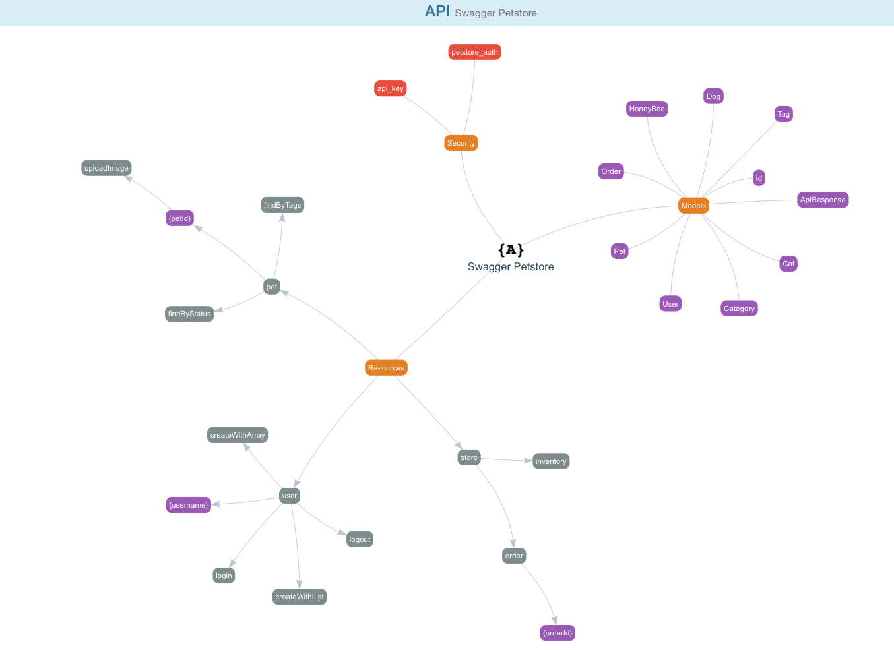

# A Chrome extension for APIs visualization
> **[swagger.ed](http://chefarchitect.github.io/apispots/projects/swaggered/)** is a simple Chrome browser extension that displays a visual representation of an API modelled using the OpenAPI spec (fka Swagger). Simply add the extension on your browser directly from the Web Store and visualize API definitions directly from the raw JSON / YAML format.

